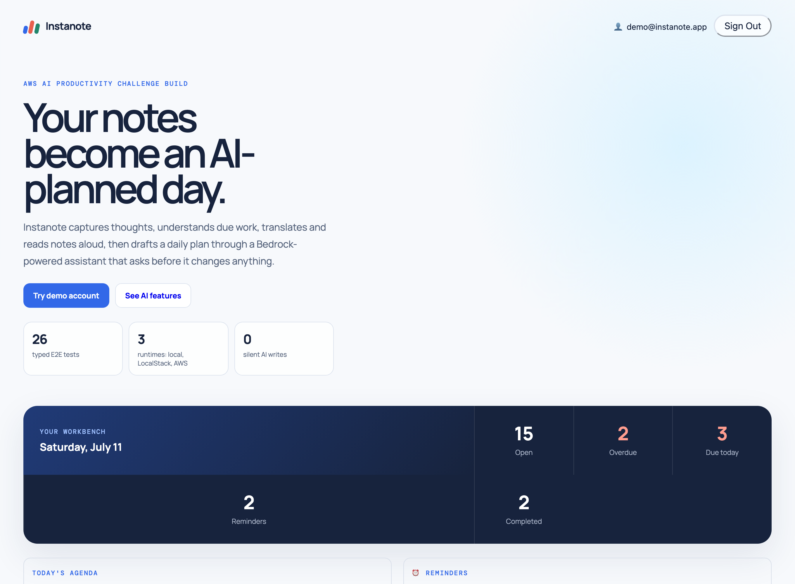
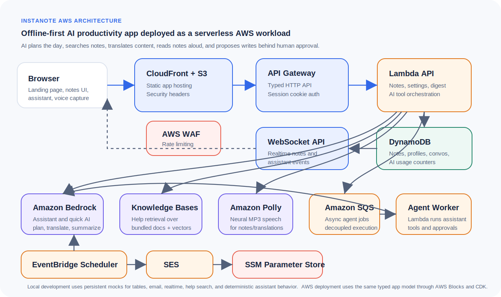

# Instanote — From Scattered Notes to a Calm, AI-Planned Day

**An AI-powered productivity workspace for notes, reminders, daily planning, translation, speech, and human-approved assistant actions.**

Instanote turns scattered notes, reminders, and due dates into a clear daily plan. It uses AI to prioritize the day, search and summarize notes, answer help questions through retrieval, translate notes, and prepare content for text-to-speech. The assistant can propose creating or completing notes, but every state-changing action pauses for an explicit Approve or Deny, so the AI helps without quietly taking control.

The project is designed to be easy to judge and easy to reproduce:

- the app works locally without an AWS account;
- the same typed application model deploys to LocalStack or AWS;
- the assistant can help, but it cannot silently change user data;
- the repo includes screenshots, architecture notes, pricing notes, security notes, and wiki-style implementation guides.



## AWS Architecture



## Friendly Overview

The everyday problem is familiar: notes pile up faster than they turn into action. Instanote gives the user one place to capture ideas, tag them, add due dates and reminders, then ask AI to turn the pile into a practical daily plan.

The product is intentionally not "just a chatbot." The AI sits inside the productivity workflow:

- it can search the user's own notes;
- it can list what is due soon;
- it can explain the app using bundled help docs;
- it can plan the day from overdue, due-today, upcoming, and undated notes;
- it can translate notes;
- it can help turn notes into audio;
- it can propose creating or completing notes;
- it must ask for approval before making state-changing edits.

That final point is the heart of the design. Instanote treats AI as a helpful teammate, not an invisible owner of the data.

## What We Built

User-facing features:

- Notes with title, details, tags, due date, reminder time, completion state, and optimistic locking.
- Dashboard showing open notes, overdue items, due-today work, reminders, and today's agenda.
- Voice capture using browser speech recognition.
- Realtime note updates across open clients when realtime transport is available.
- Daily planner powered by the quick AI path.
- Chat assistant with typed tools and human approval for writes.
- Semantic help search over bundled documentation.
- Translation to French, German, Hindi, and English.
- Text-to-speech with Amazon Polly on AWS and browser speech fallback locally.
- Optional daily 8:00 AM Asia/Kolkata digest through email.
- Hardened demo account protections.

Show-and-tell flow:

1. Open the landing page and point out the AI productivity cockpit.
2. Sign in with the demo account credentials shared separately.
3. Click **Plan my day**.
4. Ask the assistant to create a note.
5. Approve the proposed write.
6. Translate a note to Hindi.
7. Play it through text-to-speech.
8. Send a test digest.

## AI/ML Features

| Feature | What it demonstrates | Runtime path |
|---|---|---|
| Notes assistant | Tool use, conversation memory, streaming, retrieval, safe writes | AWS Blocks `Agent`, SQS, Lambda, Amazon Bedrock on AWS |
| Human approval | Guardrail for state-changing AI actions | `needsApproval: true` on mutating tools |
| Plan my day | AI prioritization and time-blocked productivity planning | Stateless quick AI agent |
| Translation | Single-shot language transformation | Quick AI path |
| Text-to-speech | Audio output for notes and translations | Amazon Polly, browser fallback locally |
| Help search | Retrieval over app docs | `KnowledgeBase`, local TF-IDF, Bedrock Knowledge Bases on AWS |
| Voice capture | Speech-to-note workflow | Browser SpeechRecognition, no backend audio upload |
| Daily digest | Scheduled productivity summary | EventBridge Scheduler + EmailClient/SES |

### Bedrock Models And Region

The deployed app uses AWS Blocks Bedrock model presets:

| Workload | AWS Blocks preset | Bedrock inference profile |
|---|---|---|
| Conversational notes assistant | `BedrockModels.BALANCED` | `global.anthropic.claude-sonnet-4-6` |
| Quick AI for planning and translation | `BedrockModels.FAST` | `global.anthropic.claude-haiku-4-5-20251001-v1:0` |

These are **global inference profiles**, so Bedrock may route inference to supported regions for availability and throughput. The app stack is currently written and tested for **`us-east-1`** because the CloudFront/WAF hosting setup and API Gateway CSP are configured around that region. If you deploy elsewhere, update the CSP in `aws-blocks/index.cdk.ts` and confirm Bedrock model/profile availability for that account and region.

## Approach

The approach is documented in [docs/approach.md](docs/approach.md).

Short version:

1. Build the full app locally first.
2. Use deterministic local mocks so development does not require AWS credentials.
3. Validate infrastructure behavior with LocalStack.
4. Deploy the same application model to AWS.
5. Add guardrails around identity, tool calls, usage, and demo-account behavior.
6. Polish the landing page and docs so the AI/ML story is obvious during judging.

## Guardrails And Evals

Guardrails:

- Backend-owned identity: the model never supplies `userId`.
- Zod schemas validate API inputs and tool parameters.
- Mutating assistant tools require human approval.
- DynamoDB partition keys isolate user data.
- Note writes use optimistic locking.
- Per-user note caps bound storage growth.
- Per-account AI call limits bound model and speech spend.
- Demo account cannot delete seeded notes or redirect digest email.
- WAF rate limiting protects the deployed edge.
- Secrets are stored outside source code.

Validation and evals:

- `npm run typecheck` validates TypeScript.
- `npm run test:unit` covers pure note-domain logic.
- `npm run test:e2e` exercises auth, CRUD, isolation, realtime, digest, help search, assistant conversations, approvals, translation, and fallbacks.
- `npm run build` validates the production frontend bundle.
- `npm run check` runs the full local quality gate.
- Playwright screenshot tooling covers the landing page and show-and-tell screens: workbench, Plan my day, translation, and voice capture. It is used for visual documentation and demo verification, while the typed E2E suite covers API behavior.

## AWS Services Used

| AWS service | Role |
|---|---|
| Amazon CloudFront | Static app delivery and edge response headers |
| Amazon S3 | Static frontend assets and knowledge-base source documents |
| AWS WAF | Per-IP rate limiting at the edge |
| Amazon API Gateway HTTP API | Typed application API |
| Amazon API Gateway WebSockets | Realtime note and assistant events |
| AWS Lambda | API handlers, digest logic, async agent workers |
| Amazon DynamoDB | Notes, profiles, conversations, AI usage counters |
| Amazon SQS | Async agent execution path |
| Amazon Bedrock | Assistant and quick AI model calls |
| Bedrock Knowledge Bases + S3 Vectors | Semantic help retrieval |
| Amazon Polly | Neural text-to-speech |
| Amazon EventBridge Scheduler | Daily digest schedule |
| Amazon SES | Digest email delivery |
| AWS Systems Manager Parameter Store | Secure runtime parameters |
| AWS CDK through AWS Blocks | Infrastructure as code |

Architecture sketch:

```text
Browser
  │
  ▼
CloudFront + S3 + WAF
  │
  ▼
API Gateway HTTP API ──▶ Lambda ──▶ DynamoDB
                         │   │
                         │   ├──▶ Amazon Bedrock
                         │   ├──▶ Amazon Polly
                         │   ├──▶ Bedrock Knowledge Bases
                         │   └──▶ SQS ──▶ Agent worker Lambda
                         │
Browser ◀── API Gateway WebSockets ◀── Realtime events

EventBridge Scheduler ──▶ Digest Lambda ──▶ Amazon SES
```

## Project Structure

```text
.
├── agentcore/                 # Offline AgentCore runtime experiment
├── aws-blocks/                # Backend blocks, CDK stack, Lambda adapter, scripts
│   ├── index.ts               # API, schemas, tools, agents, jobs
│   ├── index.cdk.ts           # AWS and LocalStack infrastructure adjustments
│   └── scripts/               # dev, deploy, destroy, sandbox lifecycle
├── docs/
│   ├── wiki/                  # Implementation, deployment, destroy, pricing guides
│   ├── screenshots/           # Landing and feature screenshots
│   ├── architecture-diagram.svg # AWS architecture diagram
│   ├── approach.md            # Product and architecture approach note
│   ├── architecture.md        # Execution flows and data boundaries
│   ├── assistant.md           # Assistant runtimes and AgentCore clarification
│   ├── blog-post.md           # Challenge article draft
│   ├── deployment.md          # Deployment checklist
│   ├── localstack.md          # LocalStack workflow and limitations
│   ├── pricing-and-cleanup.md # Cost estimate and cleanup notes
│   └── security.md            # OWASP mapping and guardrails
├── knowledge/                 # User help docs indexed by KnowledgeBase
├── scripts/                   # LocalStack fixups, demo seed, screenshots
├── src/
│   ├── domain/notes.ts        # Note filtering and due-date domain logic
│   ├── main.ts                # Browser UI and client-side interactions
│   └── styles/app.css         # Responsive visual design
├── test/                      # Unit and typed E2E tests
├── index.html                 # Landing page and app shell
├── package.json
└── cdk.json
```

Generated folders such as `dist/`, `build-temp/`, `.hosting/`, `cdk.out/`, `.bb-data/`, `.blocks-sandbox/`, and `node_modules/` are not source.

## Developer Map

Start with these files when changing the app:

| Area | File or folder | Why it matters |
|---|---|---|
| Product shell and landing page | `index.html` | Public first screen, auth mount point, app root |
| Browser app | `src/main.ts` | Notes UI, dashboard, assistant panel, translation, speech, reminders |
| Styling | `src/styles/app.css` | Responsive layout, landing page, workbench visual system |
| Note domain logic | `src/domain/notes.ts` | Filtering, summaries, due-date behavior |
| Backend composition | `aws-blocks/index.ts` | API, auth, tables, agents, tools, jobs, digest, AI guardrails |
| Infrastructure adjustments | `aws-blocks/index.cdk.ts` | AWS deployment, LocalStack compatibility, hosting/security settings |
| User help docs | `knowledge/` | Documents indexed by local TF-IDF and Bedrock Knowledge Bases |
| Tests | `test/` | Unit and typed end-to-end coverage |
| Operations | `docs/wiki/` | AWS implementation, cleanup, pricing, evaluation checklist |

## How To Run Locally

```bash
git clone https://github.com/schinchli/todo-notes-app.git
cd todo-notes-app
npm install
npm run dev
```

Open the local URL printed by the dev server.

Local state is stored under `.bb-data/`. The default assistant is deterministic and offline, so the core tool and approval flow works without external model access.

Fresh clone note: `aws-blocks/client.js` is generated code and is intentionally ignored by Git. `npm run dev`, `npm run build`, and `npm run generate-client` generate it for you.

Optional Ollama runtime:

```bash
ollama serve
ollama pull qwen3:0.6b
INSTANOTE_OLLAMA_MODEL=qwen3:0.6b npm run dev
```

## Wiki

Implementation and operations are in the wiki-style docs:

- [Wiki home](docs/wiki/Home.md)
- [How to implement in an AWS account](docs/wiki/Implement-in-AWS.md)
- [How to destroy and clean up](docs/wiki/Destroy-and-Cleanup.md)
- [Pricing estimate](docs/wiki/Pricing.md)
- [Evaluation checklist](docs/wiki/Evaluation-Checklist.md)

The challenge article intentionally points readers back here instead of trying to carry every command in the article body.

## Destroy And Cleanup

When you are done testing in AWS, clean up resources from the repo root:

```bash
npm run destroy
npm run sandbox:destroy
./scripts/localstack.sh down
```

Some knowledge-base S3 or S3 Vectors resources may be retained by design. Read [Destroy and Cleanup](docs/wiki/Destroy-and-Cleanup.md) before assuming the account is fully clean.

## Documentation

- [Approach note](docs/approach.md)
- [Architecture](docs/architecture.md)
- [Assistant runtimes](docs/assistant.md)
- [Challenge article draft](docs/blog-post.md)
- [Deployment checklist](docs/deployment.md)
- [Development workflow](docs/development.md)
- [LocalStack details](docs/localstack.md)
- [Pricing and cleanup](docs/pricing-and-cleanup.md)
- [Security and OWASP mapping](docs/security.md)

## License

No license file is currently included. Add one before distributing the project outside its intended private use.
